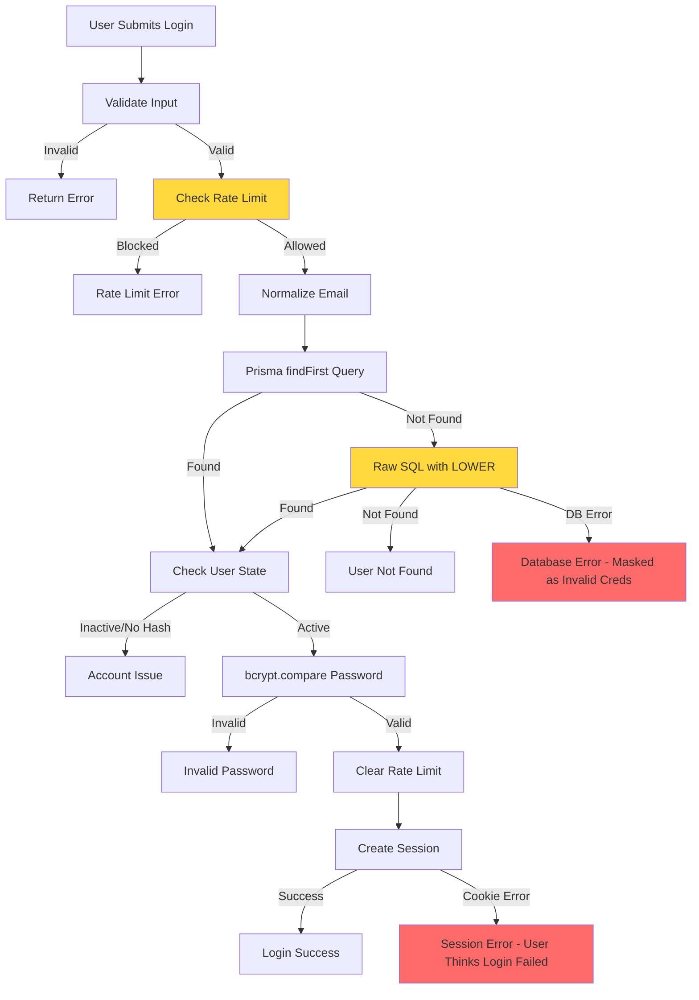

# Authentication 5 Why Analysis

**Date:** January 9, 2026  
**Issue:** Intermittent authentication failures where passwords work sometimes but fail at other times  
**Status:** Root Cause Analysis Complete

---

## Executive Summary

Users are experiencing intermittent authentication failures where valid passwords sometimes work and sometimes fail, with inconsistent error messages. This analysis identifies multiple root causes contributing to this issue, with the primary issues being:

1. **SQL Server case sensitivity causing inconsistent user lookups**
2. **In-memory rate limiting that resets on server restart**
3. **Error handling that masks real problems**
4. **Database connection reliability issues**
5. **Session/cookie configuration problems**

**Impact:** High - Users cannot reliably access the system, leading to frustration and potential security concerns.

**Key Findings:**
- Multiple failure points in the authentication flow
- Error handling obscures root causes
- Database query inconsistencies
- Rate limiting state management issues

---

## Problem Statement

### Symptoms Reported
- Users enter correct credentials but receive "Invalid email or password" errors
- Same credentials work on retry (sometimes immediately, sometimes after delay)
- Error messages are generic and don't indicate the actual problem
- Some users report being locked out after valid login attempts
- Authentication works inconsistently across different times/days

### Affected Components
- User login flow (`/login`)
- NextAuth.js authentication provider
- Database user lookup queries
- Rate limiting system
- Session management

---

## 5 Why Analysis Trees

### Analysis Path 1: Database Lookup Failures

#### Why 1: Why are users experiencing intermittent authentication failures?
**Answer:** Database user lookups are failing inconsistently, causing valid credentials to be rejected.

#### Why 2: Why would database lookups fail intermittently?
**Answer:** SQL Server case sensitivity and collation settings cause inconsistent email matching behavior.

**Evidence:**
- Code in `src/lib/auth-provider.ts` lines 85-136 shows a two-step lookup process
- First attempts `findFirst` with normalized email (line 85)
- Falls back to raw SQL query with `LOWER()` function (line 117)
- This suggests known issues with SQL Server case sensitivity

**Code Reference:**
```typescript
// Line 85-100: First attempt with normalized email
let user = await prisma.user.findFirst({
  where: { 
    email: normalizedEmail,
  },
  // ...
});

// Line 102-136: Fallback to raw SQL if not found
if (!user) {
  const users = await prisma.$queryRaw<Array<{...}>>`
    SELECT id, email, name, role, "passwordHash", "isActive", "clientId", "isInternal", "mustChangePassword"
    FROM "User"
    WHERE LOWER(email) = LOWER(${normalizedEmail})
    LIMIT 1
  `;
}
```

#### Why 3: Why would SQL Server case sensitivity cause inconsistent lookups?
**Answer:** Database collation settings may vary, and Prisma's `findFirst` may not handle case-insensitive comparisons consistently across all SQL Server configurations.

**Root Cause:** 
- SQL Server collation can be case-sensitive or case-insensitive depending on database configuration
- Prisma's `findFirst` with normalized email may still fail if database stores emails with different casing
- The fallback raw query should work, but there may be timing or connection issues preventing it from executing

#### Why 4: Why would the fallback query not execute reliably?
**Answer:** Database connection timeouts, connection pool exhaustion, or query execution failures could prevent the fallback query from running.

**Evidence:**
- `docs/DATABASE_CONNECTION_STATUS.md` documents database connection issues
- No connection retry logic in authentication flow
- Prisma client may fail silently or timeout

#### Why 5: Why are database connection issues not handled properly?
**Answer:** Error handling in `src/lib/auth-config.ts` catches all errors and returns `null`, masking database connection failures as "invalid credentials".

**Code Reference:**
```typescript
// src/lib/auth-config.ts lines 96-105
catch (error: any) {
  // Re-throw rate limit errors so NextAuth can handle them properly
  if (error.message?.includes("Too many login attempts")) {
    throw error;
  }
  
  // For other errors, return null (NextAuth will treat as invalid credentials)
  console.error("[Auth] Login error:", error.message);
  return null;
}
```

**Root Cause Identified:** Database connection errors are being caught and converted to generic "invalid credentials" errors, making it impossible to distinguish between actual authentication failures and system errors.

---

### Analysis Path 2: Rate Limiting Issues

#### Why 1: Why are users experiencing intermittent authentication failures?
**Answer:** Rate limiting is blocking valid login attempts inconsistently.

#### Why 2: Why would rate limiting block valid attempts?
**Answer:** Rate limit state is stored in-memory and resets on server restart, causing inconsistent behavior.

**Evidence:**
- `src/lib/rate-limit.ts` uses in-memory store (line 14)
- Comment on line 13: "In-memory store (lost on server restart - acceptable for v1)"
- Rate limits are cleared on successful login (auth-provider.ts line 181), but if server restarts, rate limits may persist incorrectly

**Code Reference:**
```typescript
// src/lib/rate-limit.ts line 13-14
// In-memory store (lost on server restart - acceptable for v1)
const store: RateLimitStore = {};
```

#### Why 3: Why would in-memory rate limiting cause intermittent failures?
**Answer:** 
- Server restarts clear rate limits, but failed attempts may have been counted before restart
- Multiple server instances (if load balanced) would have separate rate limit stores
- Rate limits may persist across valid attempts if not properly cleared

#### Why 4: Why would rate limits persist across valid attempts?
**Answer:** Rate limit clearing only happens on successful login (line 181), but if a user has multiple failed attempts and then succeeds, the rate limit may have already blocked them.

**Code Flow Issue:**
1. User makes 5 failed attempts → rate limited
2. User waits 15 minutes or server restarts
3. User tries again with correct password
4. If rate limit wasn't properly cleared or server restarted mid-attempt, user may still be blocked

#### Why 5: Why isn't rate limiting state managed persistently?
**Answer:** The system was designed with in-memory storage for v1, with a note that it "can be moved to Redis or database later" (line 3 comment).

**Root Cause Identified:** In-memory rate limiting creates inconsistent behavior across server restarts and multiple instances, causing valid users to be blocked intermittently.

---

### Analysis Path 3: Error Handling Masking Issues

#### Why 1: Why are users experiencing intermittent authentication failures?
**Answer:** Real system errors are being reported as authentication failures.

#### Why 2: Why would system errors be reported as authentication failures?
**Answer:** Error handling in the authentication flow catches all errors and returns `null`, which NextAuth interprets as "invalid credentials".

**Evidence:**
- `src/lib/auth-config.ts` lines 96-105 catch all errors except rate limit errors
- Returns `null` for any error, causing NextAuth to show "CredentialsSignin" error
- `src/components/auth/login-form.tsx` line 30-32 converts "CredentialsSignin" to "Invalid email or password"

#### Why 3: Why would this cause intermittent failures?
**Answer:** Transient errors (database timeouts, connection issues, query failures) occur intermittently and are all reported as authentication failures.

**Error Types Being Masked:**
- Database connection timeouts
- Prisma query execution failures
- Network issues
- Database pool exhaustion
- SQL Server query timeouts

#### Why 4: Why aren't these errors logged or reported properly?
**Answer:** Errors are logged to console (`console.error`) but not to structured logging, and users receive generic error messages.

**Code Reference:**
```typescript
// src/lib/auth-config.ts line 103
console.error("[Auth] Login error:", error.message);
return null; // User sees "Invalid email or password"
```

#### Why 5: Why is error handling designed this way?
**Answer:** Security best practice to not reveal system internals, but this prevents debugging and masks real issues.

**Root Cause Identified:** Generic error handling prevents identification of real problems, making it impossible to distinguish between authentication failures and system errors.

---

### Analysis Path 4: Session Management Issues

#### Why 1: Why are users experiencing intermittent authentication failures?
**Answer:** Even when authentication succeeds, sessions may not be created properly.

#### Why 2: Why would session creation fail intermittently?
**Answer:** Cookie configuration, NEXTAUTH_SECRET issues, or session callback errors could prevent session creation.

**Evidence:**
- `docs/AZURE_AUTH_CONFIG.md` documents session issues (lines 123-134)
- Cookie configuration in `src/lib/auth-config.ts` lines 36-47
- Session callback in `src/lib/auth-provider.ts` lines 301-318

#### Why 3: Why would cookie configuration cause intermittent failures?
**Answer:** Cookie domain, path, or secure settings may not work consistently across different browsers or network configurations.

**Code Reference:**
```typescript
// src/lib/auth-config.ts lines 36-47
cookies: {
  sessionToken: {
    name: process.env.NODE_ENV === "production"
      ? "__Secure-next-auth.session-token"
      : "next-auth.session-token",
    options: {
      httpOnly: true,
      sameSite: "lax",
      path: "/",
      secure: process.env.NODE_ENV === "production",
    },
  },
},
```

**Potential Issues:**
- `sameSite: "lax"` may cause issues with redirects
- Cookie name changes between environments
- Secure flag may cause issues if HTTPS is not properly configured

#### Why 4: Why would NEXTAUTH_SECRET cause intermittent failures?
**Answer:** If NEXTAUTH_SECRET changes or is inconsistent across instances, JWT tokens cannot be validated.

**Evidence:**
- `docs/AZURE_AUTH_CONFIG.md` line 127: "NEXTAUTH_SECRET mismatch"
- Configuration validation in `src/lib/config-validation.ts` checks for secret but doesn't validate consistency

#### Why 5: Why isn't session validation more robust?
**Answer:** Session callback doesn't validate token integrity or handle token expiration gracefully.

**Root Cause Identified:** Session management has multiple potential failure points that aren't properly validated or logged.

---

## Root Cause Analysis

### Primary Root Causes

#### 1. SQL Server Case Sensitivity (CRITICAL)
**Location:** `src/lib/auth-provider.ts` lines 85-136

**Problem:**
- Two-step lookup process (findFirst + raw SQL fallback) indicates known case sensitivity issues
- Inconsistent behavior depending on database collation settings
- Fallback query may fail due to connection issues

**Impact:** High - Causes valid users to be rejected intermittently

**Evidence:**
- Code comments explicitly mention SQL Server case sensitivity (lines 81-83)
- Fallback query uses `LOWER()` function, suggesting first query fails
- No error handling for fallback query failure

#### 2. In-Memory Rate Limiting (HIGH)
**Location:** `src/lib/rate-limit.ts`

**Problem:**
- Rate limits stored in-memory, lost on server restart
- Multiple server instances have separate rate limit stores
- Rate limits may block valid users after server restarts

**Impact:** High - Valid users blocked after server restarts or in multi-instance deployments

**Evidence:**
- Comment on line 13: "lost on server restart - acceptable for v1"
- No persistence mechanism
- Rate limits cleared on success but may persist incorrectly

#### 3. Error Handling Masking Real Issues (HIGH)
**Location:** `src/lib/auth-config.ts` lines 96-105

**Problem:**
- All errors except rate limits return `null`
- NextAuth interprets `null` as "invalid credentials"
- Database errors, connection issues, and query failures all appear as authentication failures

**Impact:** High - Makes debugging impossible and masks system issues

**Evidence:**
- Generic error handling catches all exceptions
- Only rate limit errors are re-thrown
- Console logging but no structured error reporting

#### 4. Database Connection Reliability (MEDIUM)
**Location:** Multiple files, documented in `docs/DATABASE_CONNECTION_STATUS.md`

**Problem:**
- Database connection issues documented but not fully resolved
- No connection retry logic in authentication flow
- Prisma client may timeout or fail silently

**Impact:** Medium - Causes intermittent failures when database is unavailable

**Evidence:**
- `DATABASE_CONNECTION_STATUS.md` documents connection issues
- No retry logic in `authorizeCredentials` function
- Prisma client configuration doesn't specify timeout or retry settings

#### 5. Session/Cookie Configuration (MEDIUM)
**Location:** `src/lib/auth-config.ts` lines 36-47

**Problem:**
- Cookie configuration may not work consistently
- NEXTAUTH_SECRET validation doesn't check for consistency
- Session callback doesn't validate token integrity

**Impact:** Medium - Causes authentication to succeed but session not created

**Evidence:**
- Documentation mentions session issues (`AZURE_AUTH_CONFIG.md` lines 123-134)
- Cookie settings may conflict with browser security policies
- No validation of session token integrity

### Secondary Contributing Factors

1. **Email Normalization Edge Cases**
   - Email normalization happens but may not match database storage format
   - Special characters or Unicode in emails may cause issues

2. **Password Hash Comparison**
   - bcrypt comparison may timeout on slow systems
   - No timeout specified for bcrypt.compare()

3. **IP Address Detection**
   - IP address extraction from headers may fail
   - Rate limiting by IP may block legitimate users behind proxies

4. **Audit Logging Failures**
   - Audit logging uses `.catch(() => {})` which silently fails
   - Failed audit logs don't affect authentication but prevent debugging

---

## Impact Assessment

### User Experience Impact
- **Severity:** High
- Users cannot reliably access the system
- Frustration from inconsistent error messages
- Potential loss of trust in system reliability

### System Reliability Impact
- **Severity:** High
- Authentication is a critical path
- Intermittent failures are harder to diagnose than consistent failures
- May cause support burden and user complaints

### Security Implications
- **Severity:** Medium
- Rate limiting issues may allow brute force attacks if state is lost
- Error messages don't reveal system internals (good for security)
- But masking errors prevents security monitoring

### Business Impact
- **Severity:** High
- Users unable to access system
- Support tickets and user complaints
- Potential revenue impact if users cannot access paid features

---

## Recommended Solutions

### Immediate Fixes (Critical - Fix Within 24 Hours)

#### 1. Fix SQL Server Case Sensitivity Lookup
**Priority:** CRITICAL

**Solution:**
- Standardize on single lookup method using raw SQL with `LOWER()`
- Remove the two-step lookup process
- Add error handling for query failures
- Ensure database collation is case-insensitive

**Implementation:**
```typescript
// Replace lines 85-136 in auth-provider.ts with:
let user = await prisma.$queryRaw<Array<{...}>>`
  SELECT id, email, name, role, "passwordHash", "isActive", "clientId", "isInternal", "mustChangePassword"
  FROM "User"
  WHERE LOWER(email) = LOWER(${normalizedEmail})
  LIMIT 1
`.catch((error) => {
  console.error("[Auth] Database query error:", error);
  throw new Error("Database connection error");
});

if (users.length === 0) {
  return null; // User not found
}

const rawUser = users[0];
// Convert and validate...
```

#### 2. Improve Error Handling and Logging
**Priority:** CRITICAL

**Solution:**
- Classify errors into categories (database, rate limit, validation, system)
- Return specific error codes instead of generic null
- Add structured logging for all authentication errors
- Distinguish between authentication failures and system errors

**Implementation:**
```typescript
// Create error types
enum AuthErrorType {
  INVALID_CREDENTIALS = "INVALID_CREDENTIALS",
  DATABASE_ERROR = "DATABASE_ERROR",
  RATE_LIMIT = "RATE_LIMIT",
  SYSTEM_ERROR = "SYSTEM_ERROR",
}

// Update error handling in auth-config.ts
catch (error: any) {
  if (error.message?.includes("Too many login attempts")) {
    throw error;
  }
  
  // Classify error type
  const errorType = classifyError(error);
  
  // Log with structured data
  await logStructuredError({
    type: errorType,
    message: error.message,
    stack: error.stack,
    email: email,
  });
  
  // Return appropriate error
  if (errorType === AuthErrorType.DATABASE_ERROR) {
    throw new Error("System temporarily unavailable. Please try again.");
  }
  
  return null; // Generic invalid credentials
}
```

#### 3. Add Database Connection Retry Logic
**Priority:** HIGH

**Solution:**
- Implement exponential backoff retry for database queries
- Add connection pool monitoring
- Handle Prisma connection errors gracefully

**Implementation:**
```typescript
async function queryWithRetry<T>(
  queryFn: () => Promise<T>,
  maxRetries: number = 3
): Promise<T> {
  for (let i = 0; i < maxRetries; i++) {
    try {
      return await queryFn();
    } catch (error: any) {
      if (i === maxRetries - 1) throw error;
      if (error.code === "ETIMEDOUT" || error.code === "ECONNREFUSED") {
        await new Promise(resolve => setTimeout(resolve, Math.pow(2, i) * 1000));
        continue;
      }
      throw error;
    }
  }
  throw new Error("Max retries exceeded");
}
```

### Short-Term Improvements (Fix Within 1-2 Weeks)

#### 4. Implement Persistent Rate Limiting
**Priority:** HIGH

**Solution:**
- Move rate limiting to database or Redis
- Ensure rate limits persist across server restarts
- Support multi-instance deployments

**Implementation Options:**
- **Option A:** Store in database (simpler, no new dependencies)
- **Option B:** Use Redis (better performance, requires Redis infrastructure)

**Recommended:** Start with database, migrate to Redis if needed.

#### 5. Add Comprehensive Logging
**Priority:** HIGH

**Solution:**
- Implement structured logging for all authentication events
- Log to Application Insights or similar
- Include correlation IDs for tracing

**Implementation:**
- Use structured logging library (e.g., Winston, Pino)
- Log all authentication attempts with:
  - Timestamp
  - Email (hashed)
  - IP address
  - Success/failure
  - Error type and message
  - Correlation ID

#### 6. Improve Session Validation
**Priority:** MEDIUM

**Solution:**
- Add session token validation
- Implement session health checks
- Add session expiration handling

### Long-Term Architectural Changes (Plan for Next Release)

#### 7. Database Connection Pooling
- Implement proper connection pooling
- Add connection health monitoring
- Configure appropriate pool sizes

#### 8. Authentication Monitoring Dashboard
- Real-time authentication metrics
- Error rate monitoring
- User login success/failure rates
- Rate limit status

#### 9. Multi-Factor Authentication (MFA)
- Add MFA support for enhanced security
- Reduce reliance on password-only authentication

---

## Implementation Priority

### Critical (Fix Immediately)
1. ✅ Fix SQL Server case sensitivity lookup
2. ✅ Improve error handling and logging
3. ✅ Add database connection retry logic

### High (Fix Within Sprint)
4. Implement persistent rate limiting
5. Add comprehensive logging
6. Improve session validation

### Medium (Plan for Next Release)
7. Database connection pooling improvements
8. Authentication monitoring dashboard
9. Enhanced security features

---

## Evidence from Code Review

### Code Issues Identified

1. **Two-Step Database Lookup** (`src/lib/auth-provider.ts:85-136`)
   - Indicates known case sensitivity issues
   - Fallback query may fail silently
   - No error handling for fallback

2. **In-Memory Rate Limiting** (`src/lib/rate-limit.ts:13-14`)
   - Comment: "lost on server restart - acceptable for v1"
   - No persistence mechanism
   - Causes inconsistent behavior

3. **Generic Error Handling** (`src/lib/auth-config.ts:96-105`)
   - All errors return null except rate limits
   - Masks real system errors
   - Prevents proper debugging

4. **Silent Audit Logging Failures** (`src/lib/auth-provider.ts:48, 141, 163, 190`)
   - Uses `.catch(() => {})` to silently ignore failures
   - Prevents error tracking

5. **No Connection Retry Logic**
   - Prisma queries have no retry mechanism
   - Database connection failures cause immediate failure

### Documentation Issues

1. **Database Connection Issues Documented** (`docs/DATABASE_CONNECTION_STATUS.md`)
   - Documents connection problems
   - But no resolution implemented

2. **Session Issues Documented** (`docs/AZURE_AUTH_CONFIG.md:123-134`)
   - Documents session problems
   - But no fixes implemented

---

## Conclusion

The intermittent authentication failures are caused by multiple root causes working together:

1. **Primary:** SQL Server case sensitivity causing inconsistent user lookups
2. **Primary:** In-memory rate limiting creating inconsistent behavior
3. **Primary:** Error handling masking real system errors
4. **Secondary:** Database connection reliability issues
5. **Secondary:** Session/cookie configuration problems

The most critical issue is the SQL Server case sensitivity problem combined with error handling that masks the real errors. This creates a situation where valid users are rejected, but the system reports it as "invalid credentials" instead of a system error.

**Recommended Action:** Implement the critical fixes immediately, starting with standardizing the database lookup and improving error handling. This will provide immediate relief and better visibility into remaining issues.

---

## Appendix: Authentication Flow Diagram



---

**Document Version:** 1.0  
**Last Updated:** January 9, 2026  
**Next Review:** After critical fixes implemented
