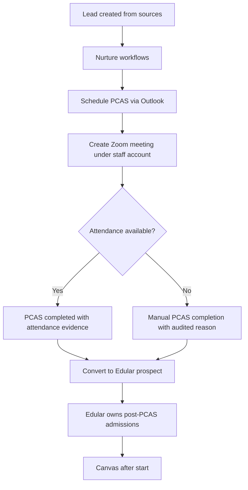

# PRD v2.3: Orion Technical College (Tenant 01)

**Version:** 2.3  
**Date:** 2025-12-26  
**Status:** Draft

## 1. Objective

Replace Orion's spreadsheet-based acquisition workflows with an acquisition and nurturing workspace that supports persona analytics and multi-touch attribution, integrates with Outlook and Zoom for PCAS operations, and hands off prospects to Edular after PCAS completion.

## 2. Systems of Record

- Pre-PCAS acquisition and nurture: EMC Workspace (Orion tenant)
- Post-PCAS admissions workflow: Edular
- Instructional delivery: Canvas

## 3. Out of Scope

- Application management
- Enrollment processing
- Student records
- Course delivery

## 4. Roles and Permissions

| Role | Permissions |
|------|-------------|
| Marketing Staff | Edit leads, schedule, send email, apply personas |
| Marketing Director | Marketing Staff plus manage personas, attribution config, campaign config |
| Admissions Staff | PCAS operations, convert to Edular |
| Admissions Director | Admissions Staff plus override PCAS completion, retry conversions, view admissions analytics |
| Leadership | All permissions, global visibility |

## 5. Required Fields for Edular Conversion

Edular API minimum (per PDF):

- `clientUid` only (other fields recommended but not required by API)

Orion business rules for conversion eligibility:

- `firstName` (string)
- `lastName` (string)
- `email` (string)
- `phone` (E.164 format)
- `program` (string)
- `domesticOrInternational` → **provisional mapping** to Edular `highSchoolType` field:
  - `"high-school-international"` for international students
  - `"high-school"` for domestic students (no `high-school-domestic` in Edular enum)
  - ⚠️ This is a workaround due to lack of canonical field. See ADR-002 for migration path.
- Campus is implicit (single campus)

Note: Orion validates more fields than Edular requires. Engineers must not assume Edular rejects missing fields.

## 6. Personas

Seed taxonomy:

- `Career_Changer`, `Veteran`, `International_Student`, `Domestic_Student`
- `Working_Adult`, `First_Time_Student`, `Upskill_Tech`, `Fast_Track_Completion`, `Cost_Sensitive`

Governance:

- Persona codes are immutable identifiers.
- Assignment sources: `manual`, `form_rule`, `campaign_mapping`, `ai_suggestion`
- AI suggestions require acceptance by Staff or Director, configurable per tenant.
- All persona changes audited.
- Store `model_version` for inferred personas and `ruleset_version` for rule-based assignments.

Schema:

```
LeadPersona:
  lead_id
  persona_code
  assignment_type: DECLARED | INFERRED
  confidence: 0.0-1.0 (INFERRED only)
  assigned_by: user_id | SYSTEM
  assigned_at: timestamp
  source: manual | form_rule | campaign_mapping | ai_suggestion
  model_version: string
  ruleset_version: string
```

## 7. Event Model for Attribution

Required event fields:

- `event_id` UUID
- `tenant_id`
- `lead_id` nullable for anonymous pre-lead events
- `session_id` links anonymous web journey events before lead creation
- `event_type`
- `event_ts`
- `ingested_at`
- `source_system`
- `payload` JSON
- `external_ids` JSON
- `consent_state` snapshot for honoring opt-outs over time

Ordering:

- Use `event_ts` as primary ordering.
- Use `ingested_at` as tie-breaker.
- Handle late-arriving events using `event_ts`.

Event types:

- `web.form_submit`
- `ad.click`
- `ad.impression` optional
- `email.sent`
- `email.opened` optional
- `calendar.event_created`
- `zoom.meeting_attendance`
- `pcas.completed`
- `edular.prospect_created`

Conversion points:

- `lead.created`
- `pcas.scheduled`
- `pcas.completed`
- `edular.converted`

Identity keys:

- `lead_id`
- `email_hash` SHA256
- `phone_hash` SHA256 of E.164
- `external_ids` such as gclid, fbclid

## 8. Key Modules

- Lead Operations
- Outlook Scheduling Module (Graph delegated, store `event_id`)
- Email Nurturing Module (Graph delegated, template library)
- Zoom PCAS Module (staff-owned meetings, attendance import, manual completion fallback)
- Edular Handoff Module (Service Bus, idempotent state machine, dead-letter UI)
- Multi-touch Attribution and Persona Studio (90-day default lookback, configurable)

## 9. Acceptance Criteria

- Staff can schedule PCAS on Outlook. Lead stores Graph `event_id`.
- Staff can send email from their mailbox. Lead timeline records send.
- Zoom PCAS created under staff Zoom account. Attendance importable or manual completion with audited reason.
- Lead cannot convert to Edular unless `pcas_completed = true`.
- Edular conversion is idempotent with state machine visibility.
- Personas are assignable and visible in analytics rollups.
- Attribution reports use 90-day default. Tenant admin can set 30 or 60.
- All config changes are versioned.

## 10. Observability Requirements

### Edular Integration Metrics

- Conversion success rate (daily, weekly)
- Conversion retry count distribution
- Dead-letter queue depth
- Edular API latency (p50, p95, p99)
- Error distribution by type (400, 409, 429, 5xx)

### Microsoft Graph Metrics

- Email send success rate
- Email send failure reasons (auth, quota, transient)
- Calendar event create/update/cancel success rate
- Token refresh failure rate

### Zoom Integration Metrics

- Meeting creation success rate
- User mapping failure rate (actionable for IT)
- Attendance import success rate
- Manual PCAS completion rate (indicates reporting access issues)

### Alerting Thresholds

| Metric | Warning | Critical |
|--------|---------|----------|
| Edular conversion success rate | < 95% | < 90% |
| Dead-letter queue depth | > 10 | > 50 |
| Graph email send failure rate | > 5% | > 10% |
| Zoom mapping failure rate | > 10% | > 25% |

### Dashboards Required

- **Ops Dashboard:** Real-time conversion pipeline health, queue depths, error rates
- **Integration Health:** Per-integration success rates, latency, failure reasons
- **Business Dashboard:** Funnel conversion rates, time-to-milestone, persona breakdowns

## 11. Implementation Phases

1. Lead store, spreadsheet backfill, core UI
2. Graph email and calendar scheduling
3. Zoom PCAS orchestration with user mapping and fallback
4. Edular handoff via Service Bus with idempotent state machine
5. Attribution, Persona Studio, dashboards

## 12. End-to-End Flow


