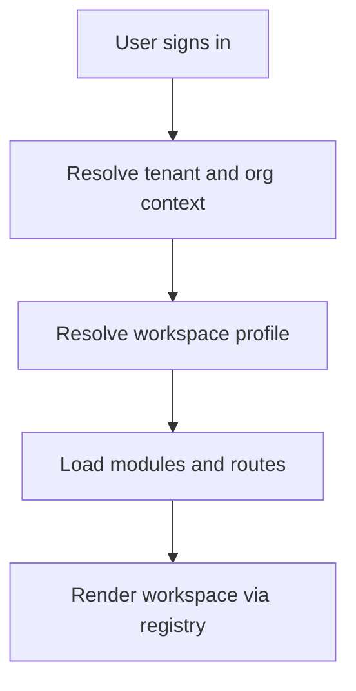
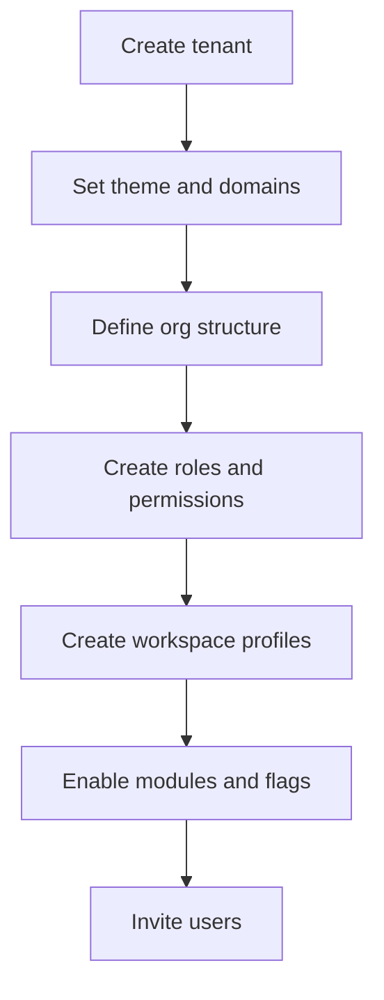

# PRD v2.0: Multi-Tenant Workspace Platform

**Version:** 2.0  
**Date:** 2025-12-26  
**Status:** Draft

## 1. Objective

Enable EMC Workspace to operate as a multi-tenant platform with org-aware workspaces composed from reusable core modules and tenant bespoke modules, without tenant hardcoding.

## 2. Goals

- Tenant isolation for data, config, API keys, and branding.
- Org model with hierarchical workspaces and scoped permissions.
- Workspace profile resolution and module registry composition runtime.
- Lead entity generalized for lead management use cases.
- Admin tooling for platform admins and tenant admins.
- Configuration versioning for analytics explainability and rollback.

## 3. Non-Goals

- A third-party plugin marketplace.
- End-user drag and drop page builder.
- Per-tenant code deployments as the default model.

## 4. Identity Architecture

- Internal tenant users (example: Orion staff) authenticate via Entra ID organizational accounts.
- External users authenticate via Azure AD B2C or Entra External ID.
- The app must support both strategies without mixing tokens or scopes.
- B2C tokens are not Graph-capable. Only Entra ID org accounts obtain delegated Graph scopes.

## 5. Core Concepts

- Tenant
- OrgUnit
- WorkspaceProfile
- Module registry and module contract
- RBAC and permission policies
- Leads and tenant-configurable fields and stages

## 6. Key Entities

- Tenant
- OrgUnit
- UserOrgMembership
- Role
- Permission
- WorkspaceProfile
- WorkspaceProfileModule
- WorkspaceProfileVersion
- TenantTheme
- FeatureFlag
- Lead
- LeadFieldDefinition
- LeadStageDefinition
- AttributionConfigVersion
- PersonaRulesetVersion

## 7. Workspace Profile Resolution

Resolution order:

1. tenant + orgUnit + role
2. tenant + orgUnit
3. tenant default
4. platform default fallback

## 8. Module Registry and Composition Runtime

- Modules are addressed by `moduleKey` and declare:
  - required permissions
  - required feature flags
  - layout slot
  - navigation metadata
- Modules must use stable platform interfaces, not direct data access.

## 9. Tenant Isolation

- Enforce tenant scoping server-side for all reads and writes.
- Tenant secrets isolated and encrypted.
- Audit log for admin actions and config changes.

## 10. Configuration Versioning

Required for explainability and safe operations:

- WorkspaceProfileVersion with publish and rollback semantics.
- AttributionConfigVersion with effective date ranges.
- PersonaRulesetVersion with effective date ranges.
- All config changes audited.

## 11. Admin Console

- EMC Platform Admin:
  - tenants, module availability, feature flags, audit logs
- Tenant Admin:
  - org units, roles, permissions, workspace profiles, lead fields, lead stages, attribution config, persona rulesets

## 12. Key Workflows

### Workspace resolution

### Tenant onboarding

