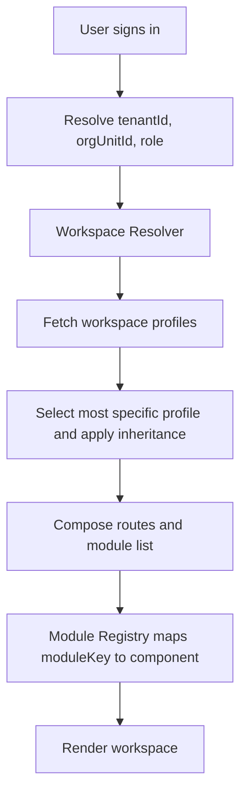

# ADR-001: Org-Aware Workspace Profiles and Module Registry

**Status:** Proposed  
**Date:** 2025-12-26  
**Owners:** Platform Architecture

## Context

EMC Workspace is evolving into a multi-tenant platform where each tenant can have a custom workspace composed from core modules and tenant bespoke modules. Orion Technical College is Tenant 01. The platform must avoid tenant hardcoding by using configuration-driven workspace composition and a stable module contract.

## Decision

### Module API Version

Set `moduleApiVersion: 1` as the initial compatibility contract for all modules. This enables evolution of the registry interface without breaking older modules.

### Workspace Profile Resolution Order

Workspace selection must be deterministic and org-aware, using the following resolution order from most specific to least specific:

1. tenant + orgUnit + role
2. tenant + orgUnit
3. tenant default
4. platform default fallback

### Module Registry Contract

Modules are registered by a stable identifier and declare capability requirements.

Required metadata:

- `moduleKey` (stable identifier)
- `moduleApiVersion` (integer, initial value: 1)
- `requiredPermissions[]`
- `requiredFeatureFlags[]`
- `layoutSlot`: `left_nav | main | right_panel | bottom_sheet`
- `navigationMetadata`: `{ path, label, icon }`

### Module API Boundaries

Modules must interact with the platform only through stable interfaces to enforce invariants such as tenant isolation (`tenantWhere`) and audit logging.

Approved interfaces:

- Hooks: `useTenantContext()`, `usePermissions()`, `useFeatureFlags()`
- Services: `LeadService`, `EventService`, `AnalyticsService`

Direct database access from modules is forbidden.

### Routing Composition

Routes are composed from the selected workspace profile's module list and routing metadata. Disabled or missing modules must not break routing. The platform must return a friendly "not available" screen.

### Profile Inheritance

Workspace profiles use base + overlay semantics:

- A base profile provides common modules.
- Overlays add, remove, or reorder modules for orgUnit or role scopes.

## Options Considered

1. Hardcode tenant UIs.
   - Rejected. Does not scale, introduces branching and regressions.
2. Build a drag and drop page builder.
   - Rejected for v2. Adds complexity and increases support burden.
3. Workspace profiles + module registry. Chosen.
   - Scales across tenants and supports controlled customization.

## Consequences

### Positive

- Prevents tenant hardcoding and supports repeatable onboarding.
- Allows tenant bespoke modules without forking the app shell.
- Enforces security invariants via controlled service interfaces.

### Negative

- Requires disciplined module contract governance and versioning.
- Requires robust validation tooling for workspace profile configs.

## Key Flow

