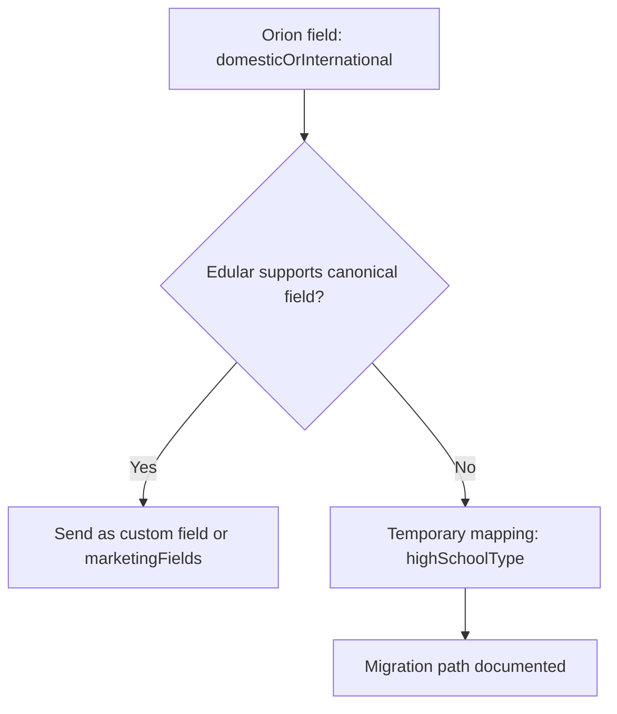

# ADR-002: PCAS-Gated Edular Handoff with Versioned Contract

**Status:** Proposed  
**Date:** 2025-12-26  
**Owners:** Platform Architecture, Data Architecture

## Context

Orion's acquisition process is spreadsheet-driven. EMC Workspace will own acquisition and nurturing through PCAS completion. After PCAS, Orion requires creation of a prospect in Edular using the Edular Leads Import API. The platform must preserve multi-touch attribution and persona analytics, while avoiding duplication of Edular workflows.

## Decision

### Bounded Context

- Pre-PCAS acquisition and nurture is owned by EMC Workspace (Orion tenant).
- Post-PCAS admissions workflows are owned by Edular.
- Instructional delivery remains in Canvas.

### Non-Goal

Application creation is out of scope. The Edular Leads Import API creates prospects only. Application intake is a UI-driven workflow in Edular and not part of this contract.

### Handoff Trigger Invariants

1. `pcas_completed` must be `true`.
2. Required Orion fields must be present: `firstName`, `lastName`, `email`, `phone`, `program`, `domesticOrInternational`.
3. Conversion command must be idempotent. Platform-layer enforcement is non-negotiable even if Edular lacks idempotency.

## Edular Leads Import API Contract (from PDF documentation)

`POST https://api.edular.com/v1/leads/create`

**Auth:** Not specified in vendor PDF (see Auth Mechanism section below)

**Content-Type:** `application/json`

### Required Fields

- `clientUid` (string, in request body) - Client identifier provided by Edular

### Orion Required Fields (business rule, not Edular minimum)

- `firstName` (string)
- `lastName` (string)
- `email` (string)
- `phone` (string) - Edular accepts but doesn't require
- `program` (string) - Edular accepts but doesn't require
- `highSchoolType` (string) - Maps domestic/international status

### Optional Fields

**Program/Enrollment:**
- `campus`, `startDate` (YYYY-MM-DD), `inquiryDate`, `inquiryMessage`

**Lead Source & Status:**
- `admissionsLeadSourceCode`, `statusName`, `studentStatusName`
- `howDidYouKnowAboutUs`, `admissionsAdvisor`

**Demographics:**
- `gender`, `dateOfBirth`, `diplomaDate`

**Address:**
- `address`, `city`, `state`, `postalCode`

**Contact Preferences:**
- `preferredTimeOfContact` (array: `["morning", "evening"]`)
- `preferredDaysOfContact` (array: `[5, 6]`)
- `notificationPreferences` (`{ "email": true, "sms": true }`)

**Marketing/Attribution:**
- `marketingFields` object (see allowed keys below)

### marketingFields Allowed Keys

UTM parameters (underscore format):
- `utm_source`, `utm_medium`, `utm_campaign`, `utm_content`, `utm_term`

Google/Meta tracking:
- `gbraid`, `wbraid`, `utm_glcid`, `cglid`

Ad platform fields:
- `ad_campaign`, `ad_id`, `ad_keyword`, `ad_medium`, `ad_source`
- `campaignid`, `srccampaignid`, `srcadset`, `srcplatform`

Other tracking:
- `captureclickkey`, `captureleadkey`, `capturelogid`
- `device`, `sessionid`, `sourceurl`, `subid`
- `mediapartnerid`, `mediapartnername`
- `kwcategory`, `matchtype`

### Canonical Attribution Keys (Platform Standard)

EMC canonical attribution keys are **snake_case** internally:

- `utm_source`, `utm_medium`, `utm_campaign`, `utm_content`, `utm_term`
- `gclid`, `fbclid`, `msclkid`

Ingestion adapters translate from whatever the source provides. Outbound adapters (like Edular) map to vendor-specific formats. This ensures consistent internal storage regardless of source or destination.

### Response Contract (CAPTURED 2025-12-26)

✅ **Validated via live API testing**

**Success Response (HTTP 200):**

```json
{
  "success": true,
  "data": {
    "id": 47584,                          // Edular user ID
    "firstName": "Test",
    "lastName": "OrionLead",
    "highSchoolType": "high-school",
    "customUserId": "EMC-TEST-123",       // Our studentId maps here
    "createdAt": "2025-12-26T23:44:16.000Z",
    "updatedAt": "2025-12-26T23:44:16.000Z",
    "profiles": [{
      "id": 39334,                        // Profile/prospect ID
      "customProfileId": "STU-39331",
      "state": "prospect",
      "type": "student",
      "startDate": "2025-09-01T00:00:00.000Z",
      "initialInquiryDate": "2025-12-26T00:00:00.000Z"
    }],
    "phones": [{
      "id": 378942,
      "phone": "+15005550001",
      "isPrimary": true,
      "corrected_phone": "+15005550001"
    }]
  },
  "errors": []
}
```

**Key Response Fields for EMC Storage:**

| Edular Response Field | EMC Storage Field | Notes |
|-----------------------|-------------------|-------|
| `data.id` | `edular_user_id` | Primary Edular identifier |
| `data.profiles[0].id` | `edular_profile_id` | Prospect profile ID |
| `data.customUserId` | (echo of our `studentId`) | Confirms correlation |
| `data.createdAt` | `edular_created_at` | Edular timestamp |

**Error Response (HTTP 400):**

```json
{
  "success": false,
  "message": "Bad Request",
  "code": "body_validation_exception",
  "data": [
    {
      "keyword": "required",
      "dataPath": "",
      "schemaPath": "#/anyOf/0/required",
      "params": { "missingProperty": "firstName" },
      "message": "should have required property 'firstName'"
    }
  ],
  "fields": {
    "firstName": ["This param is required"]
  }
}
```

**Missing clientUid Error (HTTP 400):**

```json
{
  "success": false,
  "message": "Client UID is missed",
  "code": "bad_request",
  "data": [],
  "fields": {}
}
```

### Confirmed Error Taxonomy

- 400 `body_validation_exception`: Missing/invalid fields (AJV validation errors)
- 400 `bad_request`: Missing clientUid
- 429: Rate limited (not yet tested)
- 5xx: Transient error (retry with backoff)

## Edular API Minimum vs Orion Business Rules

⚠️ **Correction from live testing (2025-12-26):** The PDF docs implied only `clientUid` is required, but live API testing revealed `firstName` (or `fullName`) is also required.

- **Edular API minimum (actual):** `clientUid` + (`firstName` OR `fullName`)
- **Edular recommended:** `clientUid`, `firstName`, `lastName`, `email`
- **Orion business rules for conversion eligibility:** also require `phone`, `program`, `highSchoolType` (domestic/international)

Note: Orion's business rules are stricter than Edular's API minimum. Our validation runs first.

## DomesticOrInternational Mapping (PROVISIONAL WORKAROUND)

⚠️ **Warning:** This mapping is semantically overloaded and should be treated as provisional.

### Current Workaround

Use the `highSchoolType` field. Allowed values per vendor PDF:

- `high-school` ← **Use for domestic students**
- `high-school-international` ← Use for international students
- `ged`
- `home-school`
- `other`

### Risk Assessment

Mapping residency/international intent to a "school type" field is problematic:

- May cause incorrect high school reporting or analytics in Edular
- May confuse staff using Edular UI
- Creates data migration pain if Edular introduces a proper field

### Migration Path



**Preferred targets (in order):**

1. `marketingFields.domestic_or_international` (if Edular allows custom keys)
2. Edular custom field mechanism (if available)
3. Current workaround: `highSchoolType` mapping

### Guardrails

- If lead is domestic and applicant later indicates international status in Edular, allow Edular to override without EMC pushing back
- Track all leads using this workaround for future migration
- **Vendor confirmation required before production use**

## Auth Mechanism

### Confirmed via Live Testing (2025-12-26)

✅ **No auth headers required.** The API accepted requests with only:
- `Content-Type: application/json`
- `clientUid` in the request body

This suggests one of:
1. **IP allowlist** is in effect (most likely)
2. `clientUid` acts as the sole auth mechanism (security concern)
3. Test environment has relaxed auth

### Recommendation

Even though no additional auth was required in testing:
- Treat `clientUid` as a **secret** (store in Key Vault)
- Confirm with Edular whether production uses IP allowlisting
- Request IP allowlist documentation for our Azure egress IPs

### Security Requirements (Non-Negotiable)

These requirements apply regardless of what auth mechanism Edular uses. This turns "unspecified" into "bounded unknown."

**Transport:**

1. TLS 1.2+ required for all Edular API calls
2. Certificate validation enabled (no skip-verify)

**Credentials:**

3. All Edular API calls route through EMC backend (never from browser)
4. `clientUid` stored in Azure Key Vault as tenant-specific secret
5. Auth must support tenant-specific credentials (each tenant has own Edular client)
6. Secrets rotated on schedule (90-day max lifetime)

**Rate Limiting and Retry:**

7. EMC-side rate limiting before calling Edular (prevent runaway retries)
8. Exponential backoff with jitter for transient failures
9. Circuit breaker pattern for sustained failures
10. Max retry count: 5 attempts over 24 hours before dead-letter

**Audit and Logging:**

11. Log all conversion attempts with request hash
12. **No PII in logs** - redact email, phone, name before logging
13. Store full payload in conversion record (encrypted at rest), not in log stream
14. IP allowlisting recommended if Edular supports (defense in depth)

## Idempotency Key Pattern

Edular API does not appear to support idempotency keys natively.

**Decision:** Enforce idempotency internally with explicit dedupe keys.

### Primary Dedupe Key (Authoritative)

```
(tenant_id, lead_id, operation_type, idempotency_key)
```

- `idempotency_key` = deterministic hash of conversion-relevant fields
- If record exists with `status = SUCCEEDED`, return cached response
- If record exists with `status = IN_PROGRESS`, wait or reject

### Secondary Safety Net (Best-Effort)

```
(tenant_id, email_hash, program_code, conversion_window_start)
```

- Catches accidental duplicates when leads get merged
- `conversion_window_start` = start of current enrollment period
- Logs warning but does not hard-block (may be legitimate re-enrollment)

### Implementation Notes

- Use `studentId` field to pass EMC lead ID for correlation on Edular side
- Treat Edular's own duplicate detection as best-effort (not guaranteed)
- Store request hash and full response for audit and debugging

## Field Mapping Table (EMC -> Edular)

| EMC Internal Field | Edular API Field | Notes |
|--------------------|------------------|-------|
| tenant.edularClientUid | clientUid | Required by Edular |
| lead.id | studentId | EMC lead ID for correlation |
| lead.firstName | firstName | Required by Orion |
| lead.lastName | lastName | Required by Orion |
| lead.email | email | Required by Orion |
| lead.phoneE164 | phone | Required by Orion |
| lead.programCode | program | Required by Orion |
| lead.campusCode | campus | Single campus for Orion |
| lead.domesticOrInternational | highSchoolType | `high-school` (domestic) or `high-school-international` |
| lead.expectedStartDate | startDate | Format: YYYY-MM-DD |
| lead.createdAt | inquiryDate | Format: YYYY-MM-DD |
| attribution.utmSource | marketingFields.utm_source | Underscore format |
| attribution.utmMedium | marketingFields.utm_medium | Underscore format |
| attribution.utmCampaign | marketingFields.utm_campaign | Underscore format |
| attribution.utmContent | marketingFields.utm_content | Underscore format |
| attribution.utmTerm | marketingFields.utm_term | Underscore format |
| attribution.gclid | marketingFields.cglid | Google click ID |
| attribution.fbclid | marketingFields.subid | Facebook click ID (or use subid) |
| lead.smsConsentStatus | notificationPreferences.sms | Boolean |
| lead.emailConsentStatus | notificationPreferences.email | Boolean |

## Normalized Response Storage

Store internally regardless of Edular response shape:

- `edular_lead_id`
- `status`: `created | already_exists | failed`
- `raw_response`: JSON blob
- `request_hash`: SHA256 of request payload
- `attempt_count`
- `last_attempt_at`

## Platform-Layer Idempotency

- Unique constraint: `(tenant_id, lead_id, operation_type, idempotency_key)`
- Conversion state machine: `NOT_STARTED | IN_PROGRESS | SUCCEEDED | FAILED | DEAD_LETTERED`
- Persist payload snapshot and response snapshot for audit and operator debugging

## Consequences

### Positive

- Clean boundary between acquisition analytics and admissions operations.
- Reliable conversion with idempotent retries and auditability.
- Full marketing attribution passthrough via `marketingFields` object.
- Consent preferences preserved via `notificationPreferences`.
- Security posture enforced regardless of vendor auth mechanism.

### Negative

- `highSchoolType` mapping is semantically overloaded (see Provisional Workaround section)

## Resolved Items (Live API Testing 2025-12-26)

- [x] `clientUid` location → **Request body** ✅
- [x] Auth mechanism → **No auth headers required** (likely IP allowlist) ✅
- [x] Edular API minimum → **`clientUid` + `firstName`** (not clientUid alone as PDF implied) ✅
- [x] `domesticOrInternational` mapping → **`highSchoolType`** works: `high-school`, `high-school-international` ✅
- [x] `highSchoolType` enum → Confirmed: `high-school`, `ged`, `high-school-international`, `home-school`, `other` ✅
- [x] `studentId` → Maps to `customUserId` in response ✅
- [x] Response schema → Captured: `data.id` (user), `data.profiles[0].id` (prospect) ✅
- [x] `marketingFields` format → **Underscore format** accepted ✅
- [x] Phone format → **E.164 accepted**, echoed as `corrected_phone` ✅
- [x] `startDate` format → **YYYY-MM-DD** accepted, stored as ISO timestamp ✅
- [x] Idempotency → **Internal enforcement** (Edular has no native mechanism) ✅

## Integration Smoke Test Checklist

| Test | Status | Result |
|------|--------|--------|
| Auth confirmed | ✅ | No headers required; clientUid in body only |
| Create lead (minimal) | ⚠️ | Requires `firstName`, not just `clientUid` |
| Create lead (recommended) | ✅ | 200 OK |
| Create lead (Orion required) | ✅ | 200 OK - all fields accepted |
| Create lead (full payload) | ✅ | 200 OK - marketingFields, startDate work |
| International student | ✅ | 200 OK - `high-school-international` works |
| Validation error (400) | ✅ | Captured - AJV validation format |
| Invalid enum (400) | ✅ | Captured - enum validation works |
| Duplicate behavior | ⏳ | TODO - test same email twice |
| Rate limit (429) | ⏳ | Not tested |
| Transient error (5xx) | ⏳ | Not tested |

## Open Items

- [ ] Confirm with Edular whether production uses IP allowlisting
- [ ] Request IP allowlist documentation for Azure egress IPs
- [ ] Test duplicate creation behavior (same email twice)
- [ ] **Validate `highSchoolType` semantic appropriateness** with Edular (works but semantically overloaded)
- [ ] Confirm migration path if Edular introduces canonical domestic/international field
