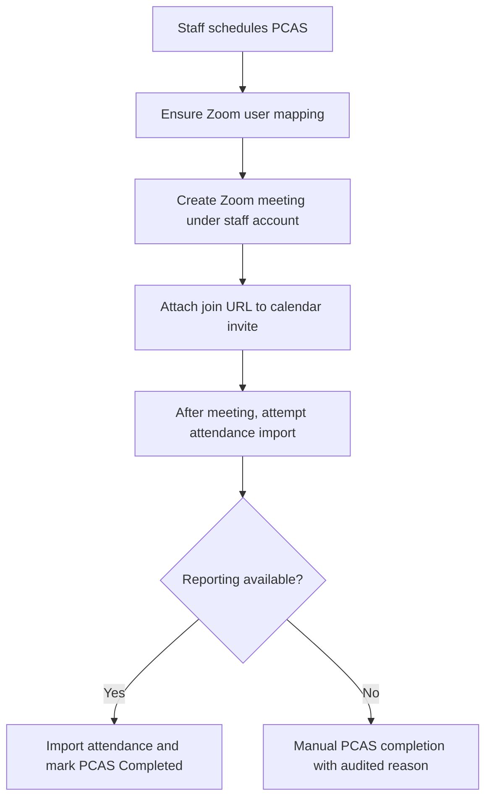

# ADR-003: Azure-Native Platform with Staff-Owned Zoom Meetings

**Status:** Accepted  
**Date:** 2025-12-26  
**Owners:** Platform Architecture, Security

## Context

Orion requires Outlook scheduling, email sending, Zoom-based PCAS sessions, and Edular conversion workflows. The project uses Azure services. Zoom meetings must be created under the staff member's own Zoom account.

## Decision

### Azure Reference Architecture

- Web app and API: Azure App Service or Azure Container Apps
- Webhooks and scheduled jobs: Azure Functions
- Async commands and retries: Azure Service Bus
- Operational store: Azure SQL or Cosmos DB
- Event store: Cosmos DB or Azure Data Explorer (ADX)
- Secrets and keys: Azure Key Vault
- Observability: Application Insights

### Zoom Ownership Model

- Meetings created under the staff member's own Zoom account.
- Requires Zoom SSO or explicit user mapping.

Identity mapping table:

- `UserZoomMapping(user_id, zoom_user_id, zoom_email, zoom_account_id)`

Scopes (subject to final Zoom app configuration):

- `meeting:write`
- `report:read:admin`

### Zoom User Mapping Lifecycle Rule

When staff first schedules PCAS and no `zoom_user_id` exists:

1. Attempt lookup by email.
2. If not found, show actionable error: "Connect Zoom account. Confirm Zoom SSO. Contact IT."

### Zoom Attendance Risk and Fallback

- `GET /report/meetings/{meetingId}/participants` requires reporting access.
- Reporting APIs may require specific plan levels and admin scopes.
- Fallback: manual PCAS completion with audited reason `attendance_verified_manually`.

### Service Bus Pattern

- Use a queue for conversion and ingestion commands.
- Implement dead-letter queues.
- Provide operator UI for inspection and retry.

## Consequences

### Positive

- Azure-native operational model with strong observability.
- Staff-owned Zoom meetings align with real operations and accountability.
- Reliable retries and failure handling.

### Negative

- Zoom reporting access may not be available in all environments.
- Requires user mapping and support flows for Zoom identity resolution.

## Key Flow

## Integration Smoke Test Checklist

### Zoom Integration

Before production, complete these validation steps:

- [ ] **Zoom app registered** - OAuth app created in Zoom marketplace
- [ ] **Scopes approved** - `meeting:write` and `report:read:admin` granted
- [ ] **Resolve `zoom_user_id`** - Lookup staff member by email
- [ ] **Create meeting** - Successfully create meeting under staff account
- [ ] **Get join URL** - Verify join URL returned and valid
- [ ] **Fetch attendance** - After test meeting, retrieve participant list
- [ ] **Attendance unavailable** - Verify fallback path works (manual completion UI)
- [ ] **User mapping failure** - Verify actionable error message displayed
- [ ] **Token refresh** - Verify long-lived token refresh works
