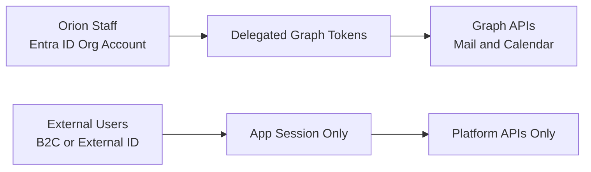

# ADR-004: Delegated Microsoft Graph with Org-Wide Admin Consent and Attribution Lookback

**Status:** Accepted  
**Date:** 2025-12-26  
**Owners:** Platform Architecture, Security

## Context

Orion staff must send email from their own mailbox and schedule PCAS appointments on their own Outlook calendar. Orion IT will grant org-wide admin consent up front. The platform also supports external users in the future via B2C, which must not be used for Graph calls.

## Decision

### Identity Plane Clarification

- Orion staff authenticate via Microsoft Entra ID organizational accounts and receive delegated Graph tokens.
- External users authenticate via Azure AD B2C or Entra External ID and get app sessions only. They do not get Graph scopes.

### Microsoft Graph Delegated Permissions

Required scopes:

- `openid`
- `profile`
- `email`
- `offline_access`
- `User.Read`
- `Mail.Send`
- `Calendars.ReadWrite`

### Admin Consent Semantics

- Org-wide admin consent means IT pre-approves scopes for all users.
- Users still authenticate interactively at least once to obtain delegated tokens.
- No per-user consent prompts after admin consent is granted.
- Must support Conditional Access and MFA.

### Token Storage Best Practice

- Persist refresh tokens in the app database, encrypted at rest.
- Manage encryption keys and app secrets in Azure Key Vault.
- Do not use Key Vault as a token database.

### Attribution Lookback Window

- Default: 90 days
- Tenant-configurable: 30, 60, or 90 days

## Consequences

### Positive

- Actions occur under user identity, improving auditability and accountability.
- Simplifies onboarding with admin consent and reduces user friction.
- Prevents accidental Graph calls for B2C identities.

### Negative

- Requires careful token lifecycle management and secure storage.
- Requires clear enforcement logic to block Graph usage for non-org identities.

## Integration Smoke Test Checklist

### Microsoft Graph Integration

Before production, complete these validation steps:

- [ ] **App registration complete** - Azure AD app registered with correct redirect URIs
- [ ] **Admin consent granted** - IT admin has granted org-wide consent for all scopes
- [ ] **Acquire delegated token** - Staff user can sign in and obtain tokens
- [ ] **Token refresh works** - Verify refresh token cycle with `offline_access`
- [ ] **Send email** - Successfully send test email via `Mail.Send`
- [ ] **Email appears in Sent folder** - Verify email sent from user's mailbox
- [ ] **Create calendar event** - Successfully create event via `Calendars.ReadWrite`
- [ ] **Event visible in Outlook** - Verify event appears on user's calendar
- [ ] **Update calendar event** - Verify reschedule works
- [ ] **Cancel calendar event** - Verify cancellation works
- [ ] **B2C token blocked** - Verify Graph calls fail gracefully for B2C identities
- [ ] **Conditional Access compatible** - Test with MFA-enabled account
